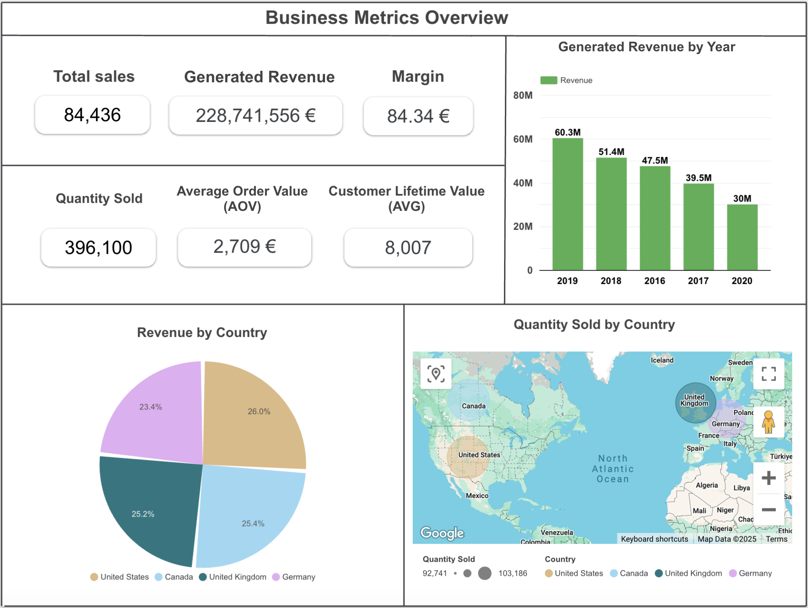

# Looker Studio BI Dashboard

This project showcases an interactive BI Dashboard that offers a comprehensive view of key business metrics, providing valuable insights into total generated revenue, product sales, trends and customer segmentation. This Google Looker Studio-powered dashboard enables data-driven decision-making by visualizing sales trends, customer purchasing patterns and geographic distribution of revenue.

# Key Features

- Key Metrics & Insights
- Generated Revenue & Total Sales Margin
- Average Order Value (AOV) & Customer Lifetime Value (CLV)
- Insights into customer spending habits and loyalty
- Top-Selling Cities & Customer Segmentation
- Visualizing product demand trends across different years and regions, identifying top-selling categories
- Revenue & Sales Charts by geographical location
- Product Line Performance
- Margin contributions by product line

# Screenshots

